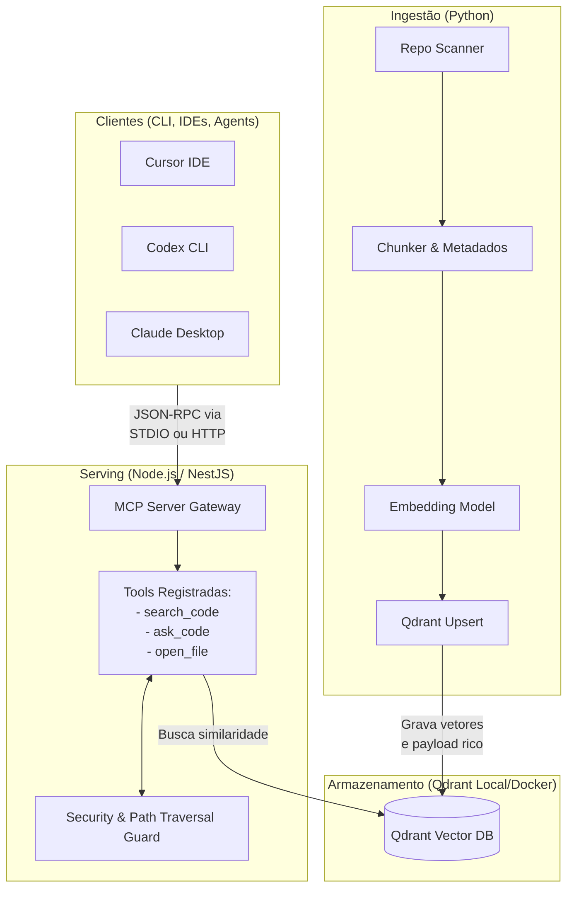

# Arquitetura do Code Compass

Esta documentação detalha a arquitetura de software do Code Compass, projetada com foco em **engenharia de plataforma**, resiliência, e clara separação de responsabilidades.

O sistema é dividido em duas grandes áreas isoladas: **Ingestão (Pipeline)** e **Serviço (Serving/MCP)**.

## Diagrama da Arquitetura

## 1. Pipeline de Ingestão (Python)
A camada responsável pela inteligência de processamento de código. Escrita em Python por ter o ecossistema mais maduro para IA, embeddings e manipulação de AST.

**Responsabilidades:**
- **Scan:** Varre os diretórios permitidos e ignora arquivos binários ou grandes demais, respeitando configurações e `.gitignore` (conceitualmente).
- **Chunker:** Divide arquivos em trechos que o LLM/Modelo de embedding consiga processar eficientemente (overlap de linhas baseados em configuração). Ao chunkar, também são gerados os metadados (linhas, path, hash de tracking).
- **Embedder:** Converte o texto fatiado em representações vetoriais usando Ollama (local) ou APIs de IA (OpenAI, etc).
- **Qdrant Upsert:** Grava cada vetor junto com os metadados brutos que permitem o filtro preciso depois (path, range, e hashes do arquivo).

> A decisão técnica do pipeline ser batch e assíncrono perante o serving evita gargalar as respostas e deixa o sistema pronto para CI/CD ou crons.

## 2. Ponto Central de Verdade (Qdrant Vector DB)
O Qdrant armazena a estrutura final que a aplicação consumirá.

**Payload de metadados em cada ponto:**
- `repo`, `branch`, `commit`
- `path`, `language`
- `startLine`, `endLine`
- Hash do conteúdo completo (para tracking de indexação).

Isso permite aplicar **Metadata Filtering** estrito (ex: "só ache resultados em arquivos .ts dentro da pasta apps/").

## 3. Serving & Gateway MCP (Node.js + NestJS)
Node.js se destaca na construção rápida de integrações Web e gateways, com ecossistema rico e assíncrono rápido (Non-blocking I/O). O NestJS traz injeção de dependência e controle de fluxo maduro.

- O server implementa a [Especificação do Model Context Protocol (MCP)](https://modelcontextprotocol.io), servindo de interface para qualquer ferramenta ou agente de IA interagir com a codebase de forma agnóstica.
- **Segurança (Path Traversal Guard):** Uma tool como `open_file` que pede o path não simplesmente abre cegamente, ela checa se este caminho está dentro do `CODEBASE_ROOT` configurado, protegendo o SO hospedeiro de escalação (`../../..`).

## 4. Clientes agnósticos
Sendo um MCP Server, o projeto se desconecta do "front-end" que vai usar os resultados. Desde o Cursor até plugins do VSCode ou até outro pipeline de auditoria, qualquer consumidor consegue bater nas rotas MCP publicadas para extrair conhecimento base sem ter que reinventar a camada de RAG.
